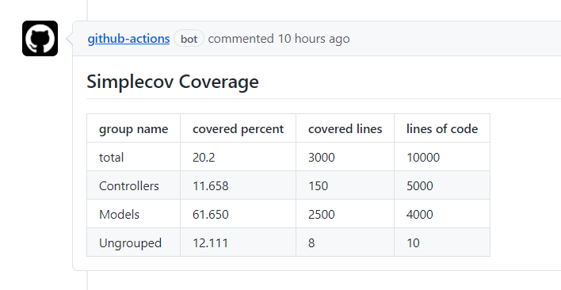

# Simplecov Report with Group metrics

A GitHub Action that report simplecov coverage with group metrics.



## Usage:

This action needs JSON file generated by following gem.

https://github.com/pi-chan/simplecov-json

The action works only with `pull_request` event.

### Inputs

- `token` - The GITHUB_TOKEN secret.
- `resultPath` - Path to last_run json file. (default: `coverage/coverage.json`)

## Example

```yaml
name: Tests
on:
  pull_request:

jobs:
  build:
    steps:
      - name: Test
        run: bundle exec rspec

      - name: Simplecov Report
        uses: pi-chan/simplecov-report-group-action@v1
        with:
          token: ${{ secrets.GITHUB_TOKEN }}
```
